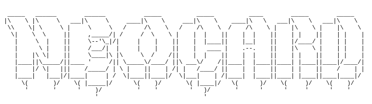

<h1 align="center">
    <picture>
      
    </picture>
</h1>

neocard is a brand new way to show off how much of a Linux beast you are.

Add a profile picture, show your distro, and flex your badges. neocard includes trackers for various different workflows and awards badges based on these stats. 

Many customization features are soon to come!
